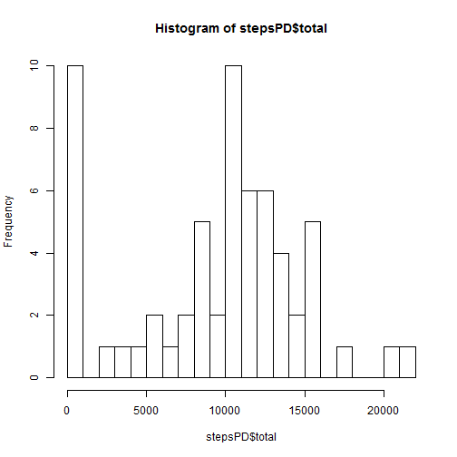
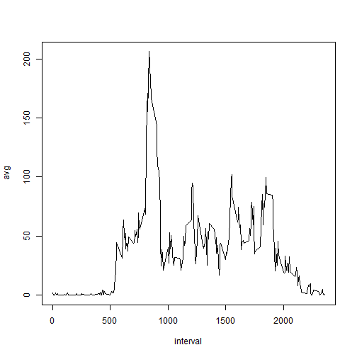
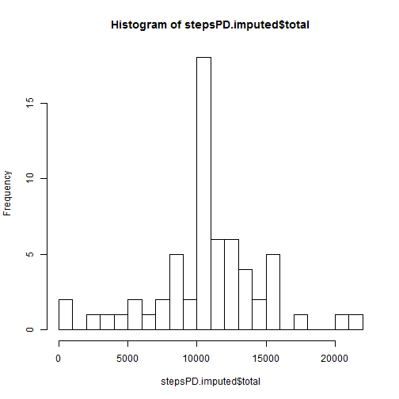
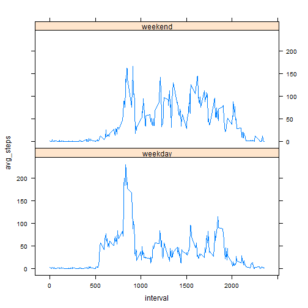

# Reproducible Research: Peer Assessment 1


## Loading and preprocessing the data

```r
data <- read.csv("activity.csv", colClasses =c("numeric", "factor", "numeric")
                 ,na.strings = "NA")
```

## What is the mean total number of steps taken per day?

```r
library(plyr)
stepsPD <- ddply(data,"date", summarize, total=sum(steps, na.rm=TRUE ))
hist(stepsPD$total, breaks=20)
```

 

```r
stepsPD.avg <- mean(stepsPD$total)
stepsPD.med <- median(stepsPD$total)
```
The mean number of steps per day is 9354.2295.  
The median number of steps per day is 1.0395 &times; 10<sup>4</sup>.

## What is the average daily activity pattern?

```r
stepsAD <- ddply(data,"interval", summarize, avg=mean(steps, na.rm=TRUE ))
with(stepsAD, plot( interval, avg, type="l" ))
```

 

```r
maxI <- which.max(stepsAD$avg)
maxInterval <- stepsAD$interval[maxI]
maxSteps    <- stepsAD$avg[maxI]
```
The interval with the highest average steps per day is the 5 minute interval starting at 835 with an average of 206.2 per day.    

## Imputing missing values

```r
n_NA <- sum(is.na(data$steps))
data.imputed <- data
for (i in 1:dim(data)[1]) {
    if ( is.na (data[i,]$steps)) {
        intervalIndex <- which( stepsAD$interval == data[i,]$interval )
        data.imputed[i,]$steps <- round(stepsAD[intervalIndex,]$avg)
    }
}

stepsPD.imputed <- ddply(data.imputed,"date", summarize, total=sum(steps))
hist(stepsPD.imputed$total, breaks=20)
```

 

```r
stepsPD.imputed.avg <- mean(stepsPD.imputed$total)
stepsPD.imputed.med <- median(stepsPD.imputed$total)

stepsReported <- sum(data$steps, na.rm=TRUE)
stepsImputed  <- sum(data.imputed$steps)
```
There are 2304 missing values in the dataset. Each missing value was imputed to be the average for that interval.  This imputation had the effect of adding 8.6096 &times; 10<sup>4</sup> steps to the dataset, raising both the mean and median number of steps per day.

After imputation:  
The mean number of steps per day is 1.0766 &times; 10<sup>4</sup>.  
The median number of steps per day is 1.0762 &times; 10<sup>4</sup>.
 

## Are there differences in activity patterns between weekdays and weekends?

```r
data.imputed$day <- weekdays(as.Date(data.imputed$date))
weekend <- rep("weekday", dim(data.imputed)[1])
weekend[data.imputed$day == "Saturday" | data.imputed$day == "Sunday"] = "weekend"
data.imputed$weekend <- weekend

stepsAD.imputed <- ddply(data.imputed,c("interval","weekend"), 
                         summarize, avg_steps=mean(steps, na.rm=TRUE ))

library(lattice)
with( stepsAD.imputed, xyplot(avg_steps ~ interval | weekend, layout=c(1,2), type="l" ))
```

 

There appear to be differences in the activity patterns between weekdays and weekends, with activity on the weekend dispersed more evenly across the day in contrast to weekdays where there is a large spike early in the day, and otherwise less activity throughout the day.
